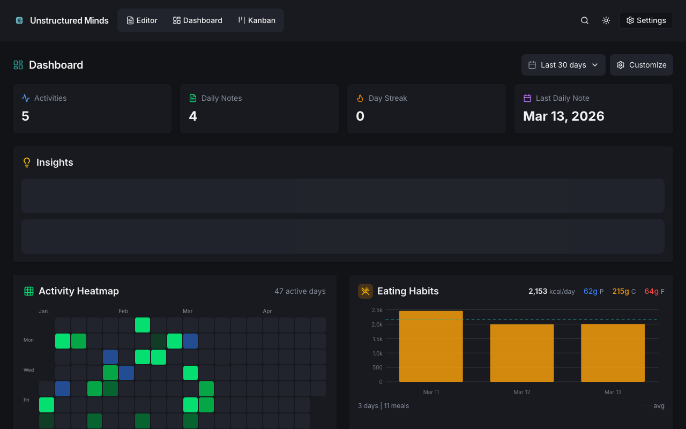
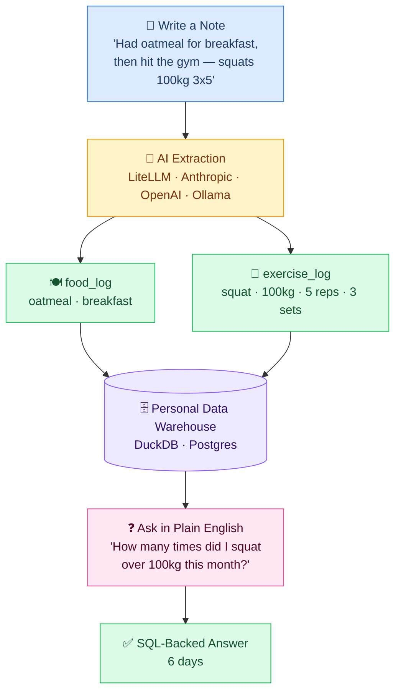

<p align="center">
  
</p>

<h3 align="center">Your second brain with a SQL engine underneath.</h3>

<p align="center">
  Write naturally in markdown. AI extracts structured data into a personal data warehouse you can query in plain English.
</p>

<p align="center">
  <a href="LICENSE"></a>
  <a href="https://github.com/dannymawani/unstructured-minds/actions/workflows/ci.yml"></a>
  <a href="https://github.com/dannymawani/unstructured-minds/stargazers"></a>
  
  
  
</p>

<p align="center">
  <a href="#quick-start">Quick Start</a> &bull;
  <a href="#features">Features</a> &bull;
  <a href="#how-it-works">How It Works</a> &bull;
  <a href="#contributing">Contributing</a>
</p>

---

<p align="center">
  
</p>

## Why Unstructured Minds?

Most note apps let you write but not **query**. Most data tools need structure upfront. Unstructured Minds bridges the gap — write freely in markdown, and AI turns your notes into a personal data warehouse. Track workouts, food, sleep, mood, or anything else, then ask questions like *"How many times did I squat over 100kg this month?"* and get real answers backed by SQL.

Everything runs on your machine. No cloud required. No vendor lock-in.

## How It Works



> **Works without an LLM** — the editor, calendar, kanban, and search all work offline. AI features (extraction and natural language queries) require an API key or a local Ollama instance.

## Features

- **Markdown Editor** — Milkdown WYSIWYG with toolbar, templates, and raw toggle
- **AI Extraction** — Write freely, AI extracts food logs, workouts, metrics, and tasks
- **Natural Language Queries** — Ask questions in plain English, get SQL-backed answers
- **Dashboards** — Activity heatmaps, exercise progress, sleep trends, mood correlations, nutrition
- **Daily Note Wizard** — One-click daily notes with structured creation flow
- **Personal Kanban** — Drag-and-drop task board synced with daily note checkboxes
- **Calendar View** — Visual calendar with daily note navigation
- **Note Assistant** — AI chat for editing notes with context
- **Full-Text Search** — Search across all vault notes with snippets and scoring
- **Command Palette** — `Cmd+K` for quick actions
- **Local-First** — All data stays on your machine. Optionally sync to Postgres for multi-user.

## Tech Stack

| Layer | Technology |
|-------|------------|
| Frontend | React 19 + Milkdown 7 + Tailwind 4 |
| Backend | Python 3.12+ / FastAPI |
| Database | DuckDB (local) / Postgres (cloud) |
| AI | Any LLM — Anthropic, OpenAI, Ollama, or [100+ providers via LiteLLM](https://docs.litellm.ai/docs/providers) |
| Auth | None (default) / Basic / [Clerk](https://clerk.com) |
| Deploy | Docker Compose |

## Quick Start

### Prerequisites

- **Docker** and **Docker Compose**
- An LLM API key *(optional — app works without it, AI features are just disabled)*

### 1. Clone and configure

```bash
git clone https://github.com/dannymawani/unstructured-minds.git
cd unstructured-minds

# Interactive setup — walks you through LLM, storage, and auth
make setup

# Or do it manually
cp .env.example .env
```

### 2. Start

```bash
docker compose up --build
```

Open **http://localhost:3000**.

### Without Docker

```bash
# Backend
cd backend && pip install -e ".[dev]"
python3 -m uvicorn src.main:app --reload

# Frontend (separate terminal)
cd frontend && npm install && npm run dev
```

### Running Tests

```bash
make test          # all tests
make test-backend  # backend only
make test-frontend # frontend only
```

## Storage Modes

| Mode | Setup | Best For |
|------|-------|----------|
| **Local** (default) | Zero config | Personal use, single machine |
| **Postgres** | `STORAGE_MODE=postgres` + `DATABASE_URL` | Multi-user, server deployment |

With Postgres mode, DuckDB still runs in-memory as a fast analytics cache.

**Bundled Postgres** — no external DB needed:
```bash
docker compose --profile postgres up -d
```

## Authentication

| Mode | Setup | Best For |
|------|-------|----------|
| `none` (default) | Zero config | Local / trusted network |
| `basic` | `AUTH_MODE=basic` + username/password in `.env` | Simple password protection |
| `clerk` | `AUTH_MODE=clerk` + Clerk keys | Multi-user SaaS deployment |

## Remote Access (Tailscale)

Access from your phone, tablet, or anywhere — encrypted, no port forwarding needed.

1. Install [Tailscale](https://tailscale.com/) on your server + devices
2. Add your Tailscale hostname to `CORS_ORIGINS` in `.env`
3. Open `http://your-hostname:3000` from any device on your tailnet

See [`docs/LAN_ACCESS.md`](./docs/LAN_ACCESS.md) for full setup including LAN-only access.

## Documentation

| Document | Description |
|----------|-------------|
| [`.env.example`](./.env.example) | All configuration options, fully commented |
| [`CLAUDE.md`](./CLAUDE.md) | Development guide and project context |
| [`ai_docs/`](./ai_docs/) | Deep technical reference (architecture, schemas, pipelines) |
| [`docs/tech-stack.md`](./docs/tech-stack.md) | Technology choices and rationale |
| [`docs/SECURITY.md`](./docs/SECURITY.md) | Security architecture and checklist |
| [`CONTRIBUTING.md`](./CONTRIBUTING.md) | Contribution guidelines |
| [`SUPPORT.md`](./SUPPORT.md) | Getting help and common issues |
| [`CHANGELOG.md`](./CHANGELOG.md) | Version history |

## Contributing

We welcome contributions! See [`CONTRIBUTING.md`](./CONTRIBUTING.md) for guidelines.

```bash
# Fork, clone, branch
git checkout -b feature/your-feature

# Make changes, test
make test

# Submit a PR
```

## License

MIT — see [LICENSE](./LICENSE) for details.
